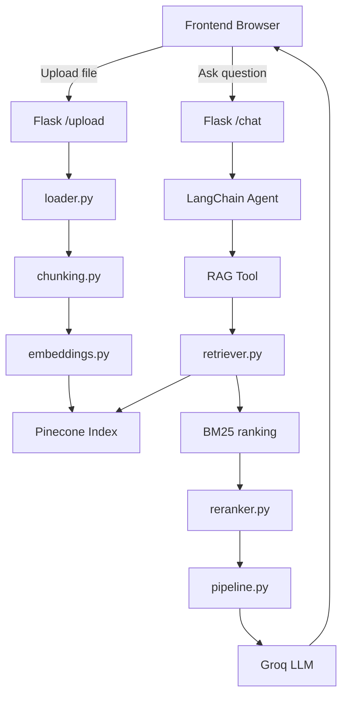

# Project Flow

This file shows how the project works from upload to answer generation.

## High-Level Flow

```text
Browser UI
   |
   | POST /upload
   v
Flask app
   |
   v
Document loader -> chunking -> embeddings -> Pinecone upsert

Browser UI
   |
   | POST /chat
   v
Flask app
   |
   v
Agent -> RAG tool -> Pinecone retrieval -> BM25 rerank -> Cross-encoder rerank -> Groq answer
```

## Upload Flow

1. The user selects a file in the frontend.
2. `frontend/script.js` sends the file to `POST /upload`.
3. `app.py` saves the file inside `data/`.
4. `backend/ingestion/loader.py` loads the file contents.
5. `backend/ingestion/chunking.py` splits the document into chunks.
6. `backend/rag/embeddings.py` creates vector embeddings.
7. `backend/vectorstore/faiss_store.py` creates or connects to the Pinecone index.
8. The chunk embeddings are upserted to Pinecone with text metadata.

## Query Flow

1. The user enters a question in the frontend.
2. `frontend/script.js` sends the prompt to `POST /chat`.
3. `app.py` passes the prompt to the LangChain agent.
4. `backend/agent/agent.py` runs the agent with memory.
5. `backend/agent/tools.py` calls the RAG tool.
6. `backend/rag/pipeline.py` starts answer generation.
7. `backend/rag/retriever.py` queries Pinecone for top matching chunks.
8. `backend/rag/retriever.py` applies BM25 scoring on the retrieved texts.
9. `backend/rag/reranker.py` re-ranks the candidate chunks with a cross-encoder.
10. `backend/rag/pipeline.py` builds a context prompt from the best chunks.
11. Groq generates the final grounded answer.
12. `app.py` streams the answer back to the browser word by word.

## Module Responsibilities

- [app.py](c:/Users/Admin/Desktop/Arii'/Genrative AI/project/RAG-BAsed_system/app.py:1): Flask routes, local file save, browser launch, response streaming
- [backend/ingestion/loader.py](c:/Users/Admin/Desktop/Arii'/Genrative AI/project/RAG-BAsed_system/backend/ingestion/loader.py:1): file loading for PDFs and text files
- [backend/ingestion/chunking.py](c:/Users/Admin/Desktop/Arii'/Genrative AI/project/RAG-BAsed_system/backend/ingestion/chunking.py:1): document chunk creation
- [backend/ingestion/ingest.py](c:/Users/Admin/Desktop/Arii'/Genrative AI/project/RAG-BAsed_system/backend/ingestion/ingest.py:1): ingestion orchestration
- [backend/rag/embeddings.py](c:/Users/Admin/Desktop/Arii'/Genrative AI/project/RAG-BAsed_system/backend/rag/embeddings.py:1): sentence-transformer embeddings
- [backend/vectorstore/faiss_store.py](c:/Users/Admin/Desktop/Arii'/Genrative AI/project/RAG-BAsed_system/backend/vectorstore/faiss_store.py:1): Pinecone index creation, upsert, and query
- [backend/rag/retriever.py](c:/Users/Admin/Desktop/Arii'/Genrative AI/project/RAG-BAsed_system/backend/rag/retriever.py:1): Pinecone retrieval plus BM25 ranking
- [backend/rag/reranker.py](c:/Users/Admin/Desktop/Arii'/Genrative AI/project/RAG-BAsed_system/backend/rag/reranker.py:1): cross-encoder reranking
- [backend/rag/pipeline.py](c:/Users/Admin/Desktop/Arii'/Genrative AI/project/RAG-BAsed_system/backend/rag/pipeline.py:1): prompt building and Groq completion
- [backend/agent/agent.py](c:/Users/Admin/Desktop/Arii'/Genrative AI/project/RAG-BAsed_system/backend/agent/agent.py:1): conversational agent setup

## Mermaid Diagram


